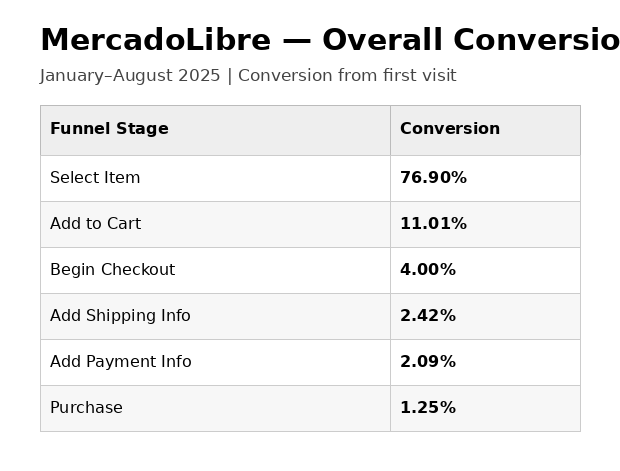
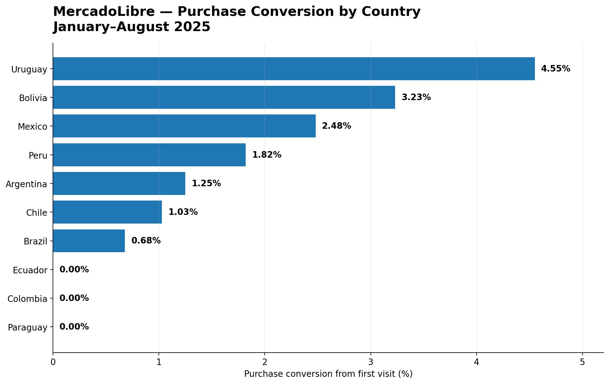
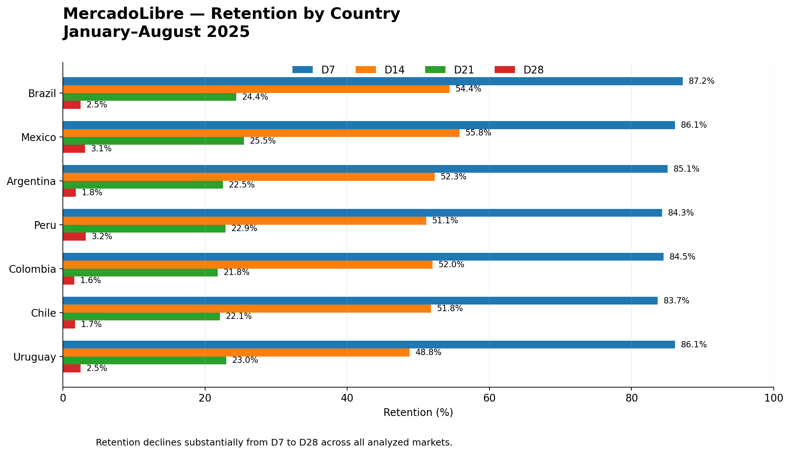

# 🛒 MercadoLibre Funnel & Retention Analysis

## Project Overview

This project analyzes MercadoLibre user behavior to evaluate **conversion funnel performance and customer retention** across Latin American markets during the period from **January to August 2025**.

Using SQL, the analysis tracks users from their first visit through the purchase stage and evaluates retention at **D7, D14, D21, and D28**.

The primary objective is to identify where users abandon the purchasing process, compare performance across countries, and detect opportunities to improve conversion and long-term engagement.

---

## 🎯 Business Questions

The analysis focuses on the following questions:

1. Where are the largest user drop-offs in the conversion funnel?
2. Which countries achieve the highest purchase conversion?
3. Which markets show the strongest and weakest funnel performance?
4. How does user retention evolve from D7 to D28?
5. Which countries demonstrate stronger long-term engagement?
6. What actions could improve conversion and retention?

---

## 🗂️ Dataset

The project uses two analytical datasets:

### Funnel dataset

Contains user-level events across the purchasing journey, including:

- First visit
- Product or promotion selection
- Add to cart
- Begin checkout
- Add shipping information
- Add payment information
- Purchase

### Retention dataset

Contains information related to:

- User signup
- Country
- Activity date
- Days after signup
- Active-user status

The analysis covers activity between **January 1, 2025 and August 31, 2025**.

---

## 🛠️ Tools & SQL Skills

- SQL
- Common Table Expressions (CTEs)
- LEFT JOIN
- CASE WHEN
- COUNT DISTINCT
- Conditional Aggregation
- GROUP BY
- DATE_TRUNC
- TO_CHAR
- NULLIF
- Cohort Analysis
- Funnel Analysis
- Retention Analysis
- Business Analysis

---

## 🔄 Analysis Workflow

**User Events → Funnel Construction → Country Segmentation → Conversion Analysis → Cohort Analysis → Retention Analysis → Business Insights → Recommendations**

---

## 📊 Conversion Funnel

The overall funnel showed a significant reduction in users as they progressed toward purchase.

| Funnel Stage | Conversion from First Visit |
|---|---:|
| Select Item | 76.90% |
| Add to Cart | 11.01% |
| Begin Checkout | 4.00% |
| Add Shipping Info | 2.42% |
| Add Payment Info | 2.09% |
| Purchase | **1.25%** |

The largest deterioration occurs before users reach the **Add to Cart** stage.

While approximately **76.90%** of first visitors interact with a product or promotion, only **11.01%** progress to adding an item to their cart.

By the end of the funnel, approximately **1.25% of first visitors complete a purchase**.

---

## 🌎 Funnel Performance by Country

Purchase conversion varied considerably across markets.

| Country | Purchase Conversion |
|---|---:|
| Uruguay | **4.55%** |
| Bolivia | **3.23%** |
| Mexico | **2.48%** |
| Peru | **1.82%** |
| Argentina | **1.25%** |
| Chile | **1.03%** |
| Brazil | **0.68%** |
| Ecuador | **0.00%** |
| Colombia | **0.00%** |
| Paraguay | **0.00%** |

### Key observation

**Uruguay achieved the strongest purchase conversion at 4.55%**, substantially outperforming the overall funnel conversion of 1.25%.

Mexico and Bolivia also showed comparatively strong purchase conversion.

At the opposite end, Ecuador, Colombia, and Paraguay recorded no completed purchases in the analyzed funnel results, indicating markets that require deeper investigation.

---

## 🔁 Retention Analysis

Retention was evaluated using user activity at four milestones:

- D7
- D14
- D21
- D28

Country-level results show that retention declines substantially as more time passes after signup.

### Selected retention results

| Country | D7 | D14 | D21 | D28 |
|---|---:|---:|---:|---:|
| Brazil | **87.2%** | 54.4% | 24.4% | 2.5% |
| Mexico | 86.1% | **55.8%** | **25.5%** | 3.1% |
| Argentina | 85.1% | 52.3% | 22.5% | 1.8% |
| Peru | 84.3% | 51.1% | 22.9% | **3.2%** |
| Colombia | 84.5% | 52.0% | 21.8% | 1.6% |
| Chile | 83.7% | 51.8% | 22.1% | 1.7% |
| Uruguay | 86.1% | 48.8% | 23.0% | 2.5% |

The results suggest strong initial engagement across several markets but a substantial decline in active users by D28.

Mexico shows particularly strong intermediate retention, while Peru records the highest D28 retention among the country-level results analyzed.

---

## 🔎 Key Findings

### 1. Purchase conversion is low relative to initial product engagement

Approximately **76.90%** of first visitors select a product or promotion, but only **11.01%** add an item to their cart and **1.25%** ultimately purchase.

This indicates that the largest opportunity is not simply attracting users to products, but helping interested users progress toward purchase.

### 2. Uruguay leads purchase conversion

Uruguay achieved a **4.55% purchase conversion rate**, the highest among the analyzed markets.

Understanding the characteristics of the Uruguay funnel could help identify practices that may be transferable to lower-performing markets.

### 3. Funnel performance varies significantly by country

Bolivia and Mexico also achieved relatively strong purchase conversion, while Brazil reached only **0.68%**.

Ecuador, Colombia, and Paraguay recorded **0% purchase conversion** in the analyzed results and should be investigated for potential funnel, operational, tracking, or market-specific issues.

### 4. Long-term retention is the primary engagement challenge

Initial D7 retention remains relatively high across countries, but D28 retention falls to low single-digit percentages.

This suggests that acquiring and initially activating users is not sufficient; maintaining engagement over the following weeks represents a major business opportunity.

---

## 💡 Business Recommendations

### 1. Optimize the transition from product interaction to cart

The largest funnel deterioration occurs between product selection and adding an item to the cart.

Potential actions include:

- simplifying the add-to-cart experience,
- reviewing product information and pricing clarity,
- evaluating shipping-cost visibility,
- testing stronger purchase incentives,
- analyzing behavioral differences between users who add products to cart and those who abandon.

### 2. Strengthen post-signup retention

Because retention declines substantially between D7 and D28, MercadoLibre could evaluate targeted lifecycle strategies such as:

- personalized product recommendations,
- cart and browsing reminders,
- targeted promotions,
- re-engagement notifications,
- loyalty or repeat-purchase incentives.

Country-level strategies should be prioritized because funnel and retention behavior differ across markets.

---

## 🧠 Business Interpretation

The analysis demonstrates that **conversion and retention should not be evaluated independently**.

A market may attract and activate users successfully but still struggle to convert them into buyers or retain them over time.

For decision-makers, the strongest opportunity therefore lies in combining funnel optimization with retention strategies rather than focusing exclusively on user acquisition.

---

## 📁 SQL Files

This repository contains three SQL analyses:

### `01_funnel_conversion_by_country.sql`

Builds the conversion funnel and compares funnel-stage conversion across countries.

Key techniques:

- CTEs
- LEFT JOIN
- COUNT DISTINCT
- NULLIF
- Funnel conversion calculations

### `02_cohort_retention_analysis.sql`

Creates monthly user cohorts and measures retention at D7, D14, D21, and D28.

Key techniques:

- DATE_TRUNC
- TO_CHAR
- CTEs
- CASE WHEN
- Conditional aggregation
- Cohort analysis

### `03_retention_users_by_country.sql`

Compares retained-user counts across countries at different retention milestones.

Key techniques:

- COUNT DISTINCT
- CASE WHEN
- GROUP BY
- Conditional aggregation
- Geographic segmentation

---

## 💼 Skills Demonstrated

This project demonstrates the ability to:

- Build multi-stage conversion funnels using SQL.
- Segment performance by country.
- Calculate conversion rates safely using `NULLIF`.
- Build user cohorts from signup dates.
- Measure retention across multiple time horizons.
- Apply conditional aggregation to behavioral data.
- Identify conversion bottlenecks.
- Translate SQL outputs into business insights.
- Develop actionable recommendations from user-behavior data.
- Communicate analytical findings for business stakeholders.

---

## 👩‍💻 Author

**Maria de Lourdes Becerra Torres**

Data Analyst | Finance & Accounting Background

---

*Portfolio project developed as part of Data Analytics training and adapted into a business-oriented SQL case study for professional presentation.*
